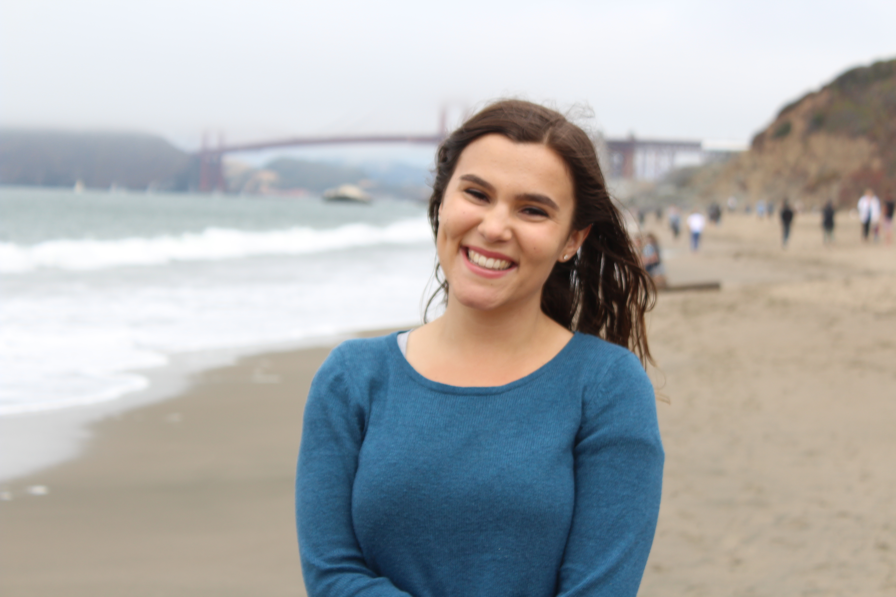

Hello! I'm Frances McQuarrie, but I prefer to go by Francie. 

I recently graduated from the University of California, Berkeley with majors in Statistics and Data Science, and a minor in Computer Science. In addition coursework, I also spent time during my undergrad developing undergraduate Data Science education at Berkeley. I spent eight semesters working as an Undergraduate Student Instructor (UGSI) for Data 8, Stat 88, and Data 100. I even had the incredible opportunity to lecture Data 8 during the summer 2019 term. 

I will begin my Masters of Science in Statistics - Advanced Methods and Data Analysis in Autumn 2020 at the University of Washington, Seattle. 

In the field, I am interested in problems related to statistical machine learning. More generally, I enjoy exploring how we can use statistically-backed methods (as opposed to black-box algorithms) to solve modern problems with incomplete information.  

I am currently recruiting for data science, machine learning, or quantitative analyst internship roles for summer 2021. More broadly, I'm still determing whether industry or academia is the best place for me. 